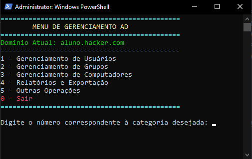

<!-- Logo -->
<p align="center">
  
</p>

<!-- Título -->
<h1 align="center">
  <span style="color: lightblue;">ControlAD</span>
</h1>

<!-- Subtítulo -->
<p align="center">
  Simplifique o gerenciamento do Active Directory.
</p>

<!-- Insígnias -->
<p align="center">
  
  
  
  
  
</p>

<!-- Visão Geral -->
## 🔎 Visão geral

**ControlAD** é uma poderosa ferramenta baseada em PowerShell, projetada para simplificar e automatizar o gerenciamento de ambientes do Active Directory (AD). Seja você um administrador de TI ou um engenheiro de sistemas, o **ControlAD** oferece um shell interativo que auxilia na execução de tarefas comuns do AD de maneira rápida e eficiente.

<!-- Thumbnail do vídeo -->

### Vídeo de apresenação:

<p align="center">
  <a href="https://www.youtube.com/watch?v=CwpZJyELo6k" target="_blank">
    
  </a>
</p>

Com o **ControlAD**, você pode:
- Gerenciar usuários, grupos e computadores.
- Redefinir senhas, habilitar/desabilitar contas e modificar atributos de usuários.
- Gerar relatórios e exportar dados para fins de auditoria.
- Realizar operações avançadas, como mover objetos entre OUs e sincronizar o AD.
- E muito mais.

_Obs: Atualmente, o software conta com 27 funcionalidades – e expandindo!_

> **ControlAD** é a solução ideal para **otimizar o gerenciamento do Active Directory**, economizando tempo e reduzindo erros.

---

## Categorias e funcionalidades

<!-- Printscreen do programa -->
<p align="center">
  
</p>

<!-- Gerenciamento de Usuários -->
<details>
  <summary><strong>👤 Gerenciamento de Usuários</strong></summary>

| Funcionalidade                   | Descrição |
|-----------------------------------|-----------|
| ```Criar Usuário```               | Cria um novo usuário no Active Directory. |
| ```Excluir Usuário```             | Exclui um usuário existente do Active Directory. |
| ```Habilitar Usuário```           | Habilita uma conta de usuário desativada. |
| ```Desabilitar Usuário```         | Desabilita uma conta de usuário ativa. |
| ```Redefinir Senha```             | Redefine a senha de uma conta de usuário. |
| ```Listar Usuários```             | Exibe todos os usuários do Active Directory. |
| ```Deletar Usuário```             | Remove permanentemente um usuário do Active Directory. |
| ```Desativar Usuário```           | Desativa a conta de um usuário ativo. |
| ```Ativar Usuário```              | Ativa uma conta de usuário desativada. |
| ```Resetar Senha```               | Altera a senha de um usuário para um valor temporário. |
| ```Bloquear Usuário```            | Bloqueia temporariamente a conta de um usuário. |
| ```Desbloquear Usuário```         | Desbloqueia uma conta de usuário bloqueada. |
| ```Alterar Atributos do Usuário```| Modifica os atributos (como nome, cargo, etc.) de um usuário. |
| ```Status do Usuário```           | Verifica se o usuário está ativo ou inativo. |
| ```SID do Usuário```              | Obtém o Security Identifier (SID) do usuário. |
| ```Membros do Usuário```          | Exibe os grupos aos quais o usuário pertence. |
| ```Caminho da OU do Usuário```    | Exibe o caminho da Unidade Organizacional (OU) onde o usuário está localizado. |
| ```Validade de Conta do Usuário```| Verifica a data de expiração da conta de um usuário. |
| ```Último Reset do Usuário```     | Exibe a data e hora do último reset de senha do usuário. |
| ```Último Logon do Usuário```     | Exibe a data e hora do último logon realizado pelo usuário. |
| ```Data de Expiração da Senha```  | Verifica a data em que a senha do usuário expira. |

</details>

<!-- Gerenciamento de Grupos -->
<details>
  <summary><strong>👥 Gerenciamento de Grupos</strong></summary>

| Funcionalidade                  | Descrição |
|----------------------------------|-----------|
| ```Criar Grupo```                | Cria um novo grupo no Active Directory. |
| ```Adicionar Usuário ao Grupo``` | Adiciona um usuário a um grupo existente. |
| ```Remover Usuário do Grupo```   | Remove um usuário de um grupo. |
| ```Listar Membros do Grupo```    | Lista todos os membros de um grupo específico. |
| ```Listar Grupos```              | Exibe todos os grupos existentes no Active Directory. |
| ```Criar Novo Grupo```           | Cria um grupo novo e vazio no Active Directory. |
| ```Verificar Membros de um Grupo```| Exibe os membros de um grupo específico. |

</details>

<!-- Gerenciamento de Computadores -->
<details>
  <summary><strong>💻 Gerenciamento de Computadores</strong></summary>

| Funcionalidade       | Descrição |
|----------------------|-----------|
| ```Listar Computadores``` | Lista todos os computadores no domínio. |
| ```Mover Computador```   | Move um computador para uma Unidade Organizacional (OU) diferente. |

</details>

<!-- Relatórios -->
<details>
  <summary><strong>📊 Relatórios e exportação</strong></summary>

| Funcionalidade              | Descrição |
|------------------------------|-----------|
| ```Exportar Relatório de Usuários``` | Exporta uma lista de todos os usuários para um arquivo CSV. |
| ```Exportar Relatório de Computadores``` | Exporta uma lista de todos os computadores para um arquivo CSV. |

</details>

<!-- Outras funcionalidades -->
<details>
  <summary><strong>Outras</strong></summary>

| Funcionalidade        | Descrição                |
|-----------------------|--------------------------|
| ```Sincronizar AD```  | Sincroniza o Active Directory com outros controladores de domínio ou ambientes. |

</details>

### Nota
> 👉  `ControlAD (1.0)` está atualmente em desenvolvimento na branch `main`.

## Como usar?
Para usar este software, siga os passos abaixo:

<!-- 1º - Clonando o repositório -->
 <strong>1️⃣ Clonando este repositório</strong>

1. Abra o PowerShell.
2. Navegue até a pasta onde você deseja clonar o repositório.
3. Execute o seguinte comando:
   ```powershell
   git clone https://github.com/GustavoRosasDev/ControlAD.git
   ```
4. Navegue para a pasta do projeto:
   ```powershell
   cd ControlAD
   ```


## Como Executar o ControlAD

Certifique-se de que você está na pasta raiz do projeto (`ControlAD/`). . Em seguida, execute o seguinte comando no PowerShell:

### Using PowerShell
  ```powershell
  .\main.ps1
  ```

## Contribuição e Licenciamento
### Contribua

Veja [CONTRIBUIÇÃO](src/docs/CONTRIBUTING.md)

### Licença
Veja [LICENÇA](src/docs/LICENSE.md)

## Feedback e Relato de Bugs

Encontrou um bug ou tem sugestões para melhorias? Por favor, abra uma [issue](https://github.com/GustavoRosasDev/ControlAD/issues) neste repositório.  

Ao relatar um bug, inclua as seguintes informações:
- Descrição detalhada do problema
- Passos para reproduzir o bug
- Resultado esperado e o resultado real
- Informações sobre o ambiente (versão do PowerShell, versão do Windows Server, etc.)
- Capturas de tela ou logs, se possível

Sua contribuição é essencial para melhorar o **ControlAD**!

---

<!-- SVG Typing -->
<p align="center"><br /><br />
    
</p><br /><br />

